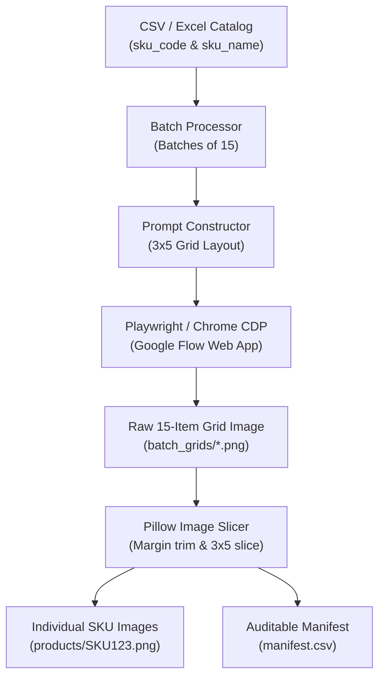

# Google Flow SKU Image Generation & Splitting Pipeline

An automated, end-to-end Python pipeline to generate high-resolution e-commerce product images from a product catalog (CSV / Excel) using **Google Flow** (`flow.google.com`), automatically download the generated grids, slice them into individual product images, and name them after their corresponding **SKU ID**.

---

## Table of Contents

- [Overview](#overview)
- [How It Works](#how-it-works)
- [Prerequisites & Installation](#prerequisites--installation)
- [Authentication & Login (Important)](#authentication--login-important)
- [Step-by-Step Running Guide](#step-by-step-running-guide)
  - [Step 1: Verify Input Data](#step-1-verify-input-data)
  - [Step 2: Run a Dry Run (Verify Prompts & Mapping)](#step-2-run-a-dry-run-verify-prompts--mapping)
  - [Step 3: Run Full Batch Production](#step-3-run-full-batch-production)
- [Alternative Workflows](#alternative-workflows)
  - [Running a Specific SKU Range (Targeted Batches & Resuming)](#running-a-specific-sku-range-targeted-batches--resuming)
  - [Saving as JPG Format](#saving-as-jpg-format)
  - [Re-Splitting Images Without the Browser (Split-Only Mode)](#re-splitting-images-without-the-browser-split-only-mode)
  - [Resetting & Starting Over](#resetting--starting-over)
- [CLI Reference](#cli-reference)
- [Output Folder Structure](#output-folder-structure)
- [Manifest & Mapping Guarantee](#manifest--mapping-guarantee)
- [Troubleshooting & FAQs](#troubleshooting--faqs)

---

## Overview

Generating individual product photos one by one via AI interfaces is time-consuming and expensive. This pipeline:
1. Batches products into groups of **15** arranged in a **3-row × 5-column** grid (optimizing for Google Flow's native 16:9 widescreen canvas to produce clean 1:1 square product cells).
2. Formulates an e-commerce studio photography prompt for Google Flow.
3. Automatically downloads the generated 15-product composite contact sheet.
4. Slices the contact sheet into **15 individual product images** with clean border trimming.
5. Saves each image using its exact SKU ID (e.g. `SKU-EL00001.png` or `SKU-EL00001.jpg`).
6. Logs the exact mapping into `manifest.csv` for 100% auditing and data integrity.

---

## How It Works



---

## Prerequisites & Installation

### 1. Python Environment
Ensure you have **Python 3.10** or newer installed:
```bash
python3 --version
```

### 2. Virtual Environment
```bash
# Create a virtual environment (if not already done)
python3 -m venv env

# Activate it:
# macOS / Linux:
source env/bin/activate
# Windows:
# .\env\Scripts\activate
```

### 3. Install Required Dependencies
Install the required Python libraries:
```bash
pip install playwright pillow pandas openpyxl
```

### 4. Install Playwright Chromium Browser
Download the Chromium browser binaries used for browser automation:
```bash
python3 -m playwright install chromium
```

---

## Authentication & Login (Important)

> **Note on Credentials:** You **do NOT** need to hardcode your Google password or credentials into any script.
> 
> Google actively blocks automated password submission forms. Instead, this pipeline connects to genuine Google Chrome via Chrome DevTools Protocol (CDP).

### Recommended Method: Attach to Your Existing Google Chrome (`--connect-existing`)
When using `--connect-existing`, the script connects to Chrome on port `9222`:
* **Auto-Launch:** If Chrome is not already running on port 9222, the script automatically launches your native macOS Google Chrome with remote debugging and a dedicated profile (`./chrome_flow_profile`).
* **Bypasses "Browser not secure" block:** Because native Google Chrome is launched directly as an official application, Google accounts accept your sign-in without any security warnings.
* **Session Persistence:** Once logged into Google and Google Flow, your session is saved in `./chrome_flow_profile` for all future runs.

If you ever need to manually start Chrome with debugging enabled:
* **macOS:**
  ```bash
  open -na "Google Chrome" --args --remote-debugging-port=9222 --user-data-dir="$PWD/chrome_flow_profile"
  ```
* **Linux:**
  ```bash
  google-chrome --remote-debugging-port=9222 --user-data-dir="$PWD/chrome_flow_profile" &
  ```
* **Windows:**
  ```cmd
  "C:\Program Files\Google\Chrome\Application\chrome.exe" --remote-debugging-port=9222 --user-data-dir="%CD%\chrome_flow_profile"
  ```

---

## Step-by-Step Running Guide

### Step 1: Verify Input Data

Ensure your CSV or Excel file contains the product SKU codes and product titles. For example, in [`sku_master_with_description.csv`](sku_master_with_description.csv):
- SKU column: `sku_code` (e.g. `SKU-EL00001`)
- Title column: `sku_name` (e.g. `ClearVision Smartphones Model-0001 - Silver / 128 GB`)

*(If your CSV uses different column headers, pass `--sku-col "YOUR_COL"` and `--title-col "YOUR_COL"`).*

---

### Step 2: Run a Dry Run (Verify Prompts & Mapping)

Before opening any browser, run a dry-run to ensure the catalog parses correctly, batches are built properly, and prompts are structured as expected:

```bash
python3 generate_sku_flow_images.py \
    --input "sku_master_with_description.csv" \
    --dry-run \
    --start-batch 1 \
    --end-batch 2
```

**What this does:**
- Validates the CSV rows.
- Prints the exact product mapping for Batch 1 and Batch 2 (15 products per batch).
- Generates sample prompts into `./output_images/prompts/` without launching any browser.

---

### Step 3: Run Full Batch Production

To process batches (for example, Batch 1 and Batch 2 = 30 products):

```bash
python3 generate_sku_flow_images.py \
    --connect-existing \
    --start-batch 1 \
    --end-batch 2
```

**What happens:**
1. Connects to your Chrome browser session at your project workspace (`https://flow.google.com/project/...`).
2. Reuses your open Google Flow project tab without reloading.
3. Automatically inputs the 15-product prompt into the ProseMirror editor and triggers generation.
4. Waits for Google Flow to complete generation (up to 300s timeout).
5. Downloads the 3x5 grid into `output_images/batch_grids/batch_00001_grid.png`.
6. Slices the grid into 15 individual product images in `output_images/products/`:
   - `SKU-EL00001.png`
   - `SKU-EL00002.png`
   - ...
   - `SKU-EL00015.png`
7. Appends full execution details and mappings to `output_images/manifest.csv`.

> **Resume Capability:** If execution stops or gets interrupted, simply re-run the same command. The script checks `manifest.csv` and automatically **skips all batches that were already successfully generated**.

---

## Alternative Workflows

### Running a Specific SKU Range (Targeted Batches & Resuming)
You can process any specific portion of your catalog instead of starting from the beginning by specifying a **Start SKU**, an **End SKU** (both inclusive), and a **Batch Size**:

```bash
python3 generate_sku_flow_images.py \
    --connect-existing \
    --start-sku "SKU-AP10401" \
    --end-sku "SKU-AP15286" \
    --batch-size 15
```

**Workflow highlights:**
1. **Subset Isolation:** Finds all products between the specified start and end SKU IDs and processes only that subset.
2. **Batch Chunking:** Automatically divides the selected products into batches of the specified size (e.g. 15 per batch).
3. **Collision-Free Storage:** Saves raw composite grids and prompt logs tagged by SKU ID (e.g. `batch_00001_SKU-AP10401_grid.png`), ensuring previous runs are never overwritten.
4. **Smart Resume Guarantee:** Skips batches only when all products in that batch have completed successfully in `manifest.csv` and their image files exist on disk.
5. **SKU Filenames:** Slices and saves each individual image named directly after its SKU ID (e.g. `output_images/products/SKU-AP10401.png`).

You can test any SKU range with a dry-run first:
```bash
python3 generate_sku_flow_images.py \
    --dry-run \
    --start-sku "SKU-AP10401" \
    --end-sku "SKU-AP15286" \
    --batch-size 15 \
    --start-batch 1 \
    --end-batch 2
```

---

### Saving as JPG Format
To generate images in JPG format instead of PNG:

```bash
python3 generate_sku_flow_images.py \
    --connect-existing \
    --format jpg \
    --start-batch 1 \
    --end-batch 5
```
*(Images will be named `SKU-EL00001.jpg`, etc., with clean RGB white background).*

---

### Re-Splitting Images Without the Browser (Split-Only Mode)
If you already downloaded batch grids and want to re-slice them (e.g., to convert PNG to JPG, or test different slicing dimensions):

```bash
python3 generate_sku_flow_images.py \
    --split-only \
    --start-batch 1 \
    --end-batch 5
```
*(Runs offline in milliseconds without launching Chrome or using any network).*

---

### Resetting & Starting Over
If you want to clear previous progress and run all batches from scratch:

* **Reset everything (images, grids, manifest):**
  ```bash
  rm -rf output_images/*
  ```
* **Or run with `--force`:**
  ```bash
  python3 generate_sku_flow_images.py --connect-existing --force --start-batch 1 --end-batch 5
  ```

---

## CLI Reference

| Flag | Default | Description |
| :--- | :--- | :--- |
| `--input`, `-i` | `sku_master_with_description.csv` | Path to CSV or Excel catalog file. |
| `--sku-col` | `sku_code` | Column header for SKU ID in input file. |
| `--title-col` | `sku_name` | Column header for Product Title in input file. |
| `--output-dir`, `-o` | `./output_images` | Root folder for generated images and logs. |
| `--format`, `-f` | `png` | Image format for individual files: `png`, `jpg`, or `jpeg`. |
| `--start-sku`, `-s` | `None` (Start of file) | Start SKU ID (inclusive) to begin processing from. |
| `--end-sku`, `-e` | `None` (End of file) | End SKU ID (inclusive) to stop processing at. |
| `--batch-size`, `-b` | `15` | Number of products per composite image. |
| `--grid-rows` | `3` | Number of rows in grid (rows × cols = batch size). |
| `--grid-cols` | `5` | Number of columns in grid. |
| `--start-batch` | `1` | First batch index to process (1-based). |
| `--end-batch` | `None` (All) | Last batch index to process. |
| `--flow-url` | Project URL | Web URL for Google Flow project workspace. |
| `--profile-dir` | `./google_flow_profile` | Directory storing saved browser cookies/session. |
| `--connect-existing` | `False` | Connect to existing Chrome running on CDP. |
| `--cdp-url` | `http://127.0.0.1:9222` | CDP endpoint URL for `--connect-existing`. |
| `--wait-seconds` | `300` | Maximum seconds to wait for AI generation per batch. |
| `--slow-mode` | `5.0` | Cooldown time in seconds between batches. |
| `--retries` | `1` | Retry count per batch on failure. |
| `--force` | `False` | Re-generate batches even if marked success in manifest. |
| `--split-only` | `False` | Skip browser; re-split existing downloaded batch grids. |
| `--dry-run` | `False` | Parse CSV and output prompt text files without opening browser. |

---

## Output Folder Structure

When the script runs, it generates the following directory structure inside `--output-dir`:

```text
output_images/
├── products/                  # Final individual product images named by SKU
│   ├── SKU-EL00001.png
│   ├── SKU-EL00002.png
│   └── ...
├── batch_grids/               # Raw 3x5 composite contact sheets from Google Flow
│   ├── batch_00001_grid.png
│   ├── batch_00002_grid.png
│   └── ...
├── prompts/                   # Exact prompt text files submitted for each batch
│   ├── batch_00001_prompt.txt
│   └── ...
├── debug/                     # Screenshots saved automatically if an error occurs
│   └── batch_00002_attempt_1.png
└── manifest.csv               # Complete CSV record of every SKU, file, and status
```

---

## Manifest & Mapping Guarantee

Every single generated file is tracked in `manifest.csv`. This guarantees that you can audit and verify which product title produced which image and SKU ID:

| batch_number | position_in_batch | grid_row | grid_col | sku_id | product_title | product_image_file | raw_grid_file | status | timestamp |
| :--- | :--- | :--- | :--- | :--- | :--- | :--- | :--- | :--- | :--- | :--- |
| 1 | 1 | 1 | 1 | SKU-EL00001 | ClearVision Smartphones Model-0001... | output_images/products/SKU-EL00001.png | output_images/batch_grids/batch_00001_grid.png | success | 2026-09-29 16:35:45 |
| 1 | 2 | 1 | 2 | SKU-EL00002 | TechPrime Laptops Model-0002... | output_images/products/SKU-EL00002.png | output_images/batch_grids/batch_00001_grid.png | success | 2026-09-29 16:35:45 |

---

## Troubleshooting & FAQs

### Q: "This browser or app may not be secure" on Google Login
**Solution:** Google blocks automated test browsers. Run with `--connect-existing`. The script will connect to or auto-launch your native Google Chrome installation, which Google permits for normal sign-in.

### Q: "Image generation timed out"
**Solution:** Google Flow generation speeds can vary under peak load. The default timeout is now set to 300 seconds. You can increase it further if needed:
```bash
python3 generate_sku_flow_images.py --connect-existing --wait-seconds 450
```

### Q: "How do I re-run only failed batches?"
**Solution:** By default, the script skips successful batches. Just run the command again without `--force`, and it will pick up only missing or failed batches.

### Q: "How do I reset and start over?"
**Solution:** Either delete the output directory (`rm -rf output_images/*`) or run with `--force`.
