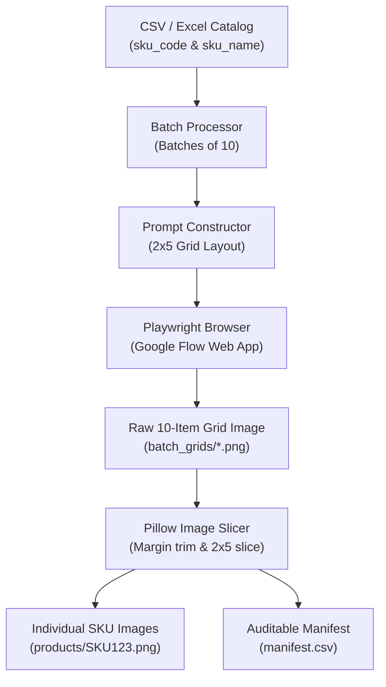

# Google Flow SKU Image Generation & Splitting Pipeline

An automated, end-to-end Python pipeline to generate high-resolution e-commerce product images from a product catalog (CSV / Excel) using **Google Flow** (`labs.google/fx/tools/flow`), automatically download the generated grids, slice them into individual product images, and name them after their corresponding **SKU ID**.

---

## Table of Contents

- [Overview](#overview)
- [How It Works](#how-it-works)
- [Prerequisites & Installation](#prerequisites--installation)
- [Authentication & Login (Important)](#authentication--login-important)
- [Step-by-Step Running Guide](#step-by-step-running-guide)
  - [Step 1: Verify Input Data](#step-1-verify-input-data)
  - [Step 2: Run a Dry Run (Verify Prompts & Mapping)](#step-2-run-a-dry-run-verify-prompts--mapping)
  - [Step 3: Run a Single Test Batch](#step-3-run-a-single-test-batch)
  - [Step 4: Run Full Batch Production](#step-4-run-full-batch-production)
- [Alternative Workflows](#alternative-workflows)
  - [Connecting to Your Existing Chrome (Recommended for 2FA)](#connecting-to-your-existing-chrome-recommended-for-2fa)
  - [Saving as JPG Format](#saving-as-jpg-format)
  - [Re-Splitting Images Without the Browser (Split-Only Mode)](#re-splitting-images-without-the-browser-split-only-mode)
- [CLI Reference](#cli-reference)
- [Output Folder Structure](#output-folder-structure)
- [Manifest & Mapping Guarantee](#manifest--mapping-guarantee)
- [Troubleshooting & FAQs](#troubleshooting--faqs)

---

## Overview

Generating individual product photos one by one via AI interfaces is time-consuming and expensive. This pipeline:
1. Batches products into groups of **10** arranged in a **2-row × 5-column** grid.
2. Formulates an e-commerce studio photography prompt for Google Flow.
3. Automatically downloads the generated 10-product composite contact sheet.
4. Slices the contact sheet into **10 individual product images** with clean border trimming.
5. Saves each image using its exact SKU ID (e.g. `SKU-EL00001.png` or `SKU-EL00001.jpg`).
6. Logs the exact mapping into `manifest.csv` for 100% auditing and data integrity.

---

## How It Works



---

## Prerequisites & Installation

### 1. Python Environment
Ensure you have **Python 3.10** or newer installed:
```bash
python3 --version
```

### 2. (Optional but recommended) Virtual Environment
```bash
# Create a virtual environment
python3 -m venv venv

# Activate it:
# On Linux / macOS:
source venv/bin/activate
# On Windows:
# .\venv\Scripts\activate
```

### 3. Install Required Dependencies
Install the required Python libraries:
```bash
pip install playwright pillow pandas openpyxl
```

### 4. Install Playwright Chromium Browser
Download the Chromium browser binaries used for browser automation:
```bash
playwright install chromium
```

---

## Authentication & Login (Important)

> **Note on Credentials:** You **do NOT** need to put your Google password or credentials into any file.
> 
> Google actively blocks automated password submission forms. Instead, this tool uses two standard, secure approaches:

### Method A: Persistent Browser Profile (Default)
When you first run the script, a visible browser window opens using a local profile stored at `./google_flow_profile`:
1. Log in to your Google Account manually in that browser window.
2. Complete any 2FA or security prompts.
3. Your login session, cookies, and tokens are saved in `./google_flow_profile`.
4. **All future script runs will open already logged in!**

### Method B: Attach to Your Existing Google Chrome (`--connect-existing`)
If you already use Google Chrome logged into Google Flow, you can attach the script directly to your browser without logging in again:
1. Start Chrome with remote debugging enabled from your terminal:
   - **Linux:**
     ```bash
     google-chrome --remote-debugging-port=9222
     ```
   - **macOS:**
     ```bash
     /Applications/Google\ Chrome.app/Contents/MacOS/Google\ Chrome --remote-debugging-port=9222
     ```
   - **Windows:**
     ```cmd
     "C:\Program Files\Google\Chrome\Application\chrome.exe" --remote-debugging-port=9222
     ```
2. Navigate to [Google Flow](https://labs.google/fx/tools/flow) and make sure you are signed in.
3. Run the script with `--connect-existing`.

---

## Step-by-Step Running Guide

### Step 1: Verify Input Data

Ensure your CSV or Excel file contains the product SKU codes and product titles. For example, in [`sku_master_with_description.csv`](sku_master_with_description.csv):
- SKU column: `sku_code` (e.g. `SKU-EL00001`)
- Title column: `sku_name` (e.g. `ClearVision Smartphones Model-0001 - Silver / 128 GB`)

*(If your CSV uses different column headers, pass `--sku-col "YOUR_COL"` and `--title-col "YOUR_COL"`).*

---

### Step 2: Run a Dry Run (Verify Prompts & Mapping)

Before opening any browser, run a dry-run to ensure the catalog parses correctly, batches are built properly, and prompts are structured as expected:

```bash
python generate_sku_flow_images.py \
    --input "sku_master_with_description.csv" \
    --dry-run \
    --start-batch 1 \
    --end-batch 2
```

**What this does:**
- Validates the CSV rows.
- Prints the exact product mapping for Batch 1 and Batch 2.
- Generates sample prompts into `./output_images/prompts/` without touching the browser.

---

### Step 3: Run a Single Test Batch

Run batch 1 to verify the full end-to-end browser automation, Google Flow generation, download, and image splitting:

```bash
python generate_sku_flow_images.py \
    --input "sku_master_with_description.csv" \
    --output-dir "./output_images" \
    --start-batch 1 \
    --end-batch 1
```

**What happens:**
1. A Chromium browser window opens at `https://labs.google/fx/tools/flow`.
2. If it's your first time, log in to your Google Account. Once the Flow workspace loads, the script submits the prompt.
3. The script waits for Google Flow to generate the image.
4. The 2x5 grid is downloaded to `output_images/batch_grids/batch_00001_grid.png`.
5. The grid is split into 10 separate files in `output_images/products/`:
   - `SKU-EL00001.png`
   - `SKU-EL00002.png`
   - ...
   - `SKU-EL00010.png`
6. `output_images/manifest.csv` is updated with full details.

---

### Step 4: Run Full Batch Production

To process a range of batches (for example, the first 10 batches = 100 products):

```bash
python generate_sku_flow_images.py \
    --input "sku_master_with_description.csv" \
    --output-dir "./output_images" \
    --start-batch 1 \
    --end-batch 10 \
    --slow-mode 8.0
```

> **Resume Capability:** If execution stops or gets interrupted, simply re-run the same command. The script checks `manifest.csv` and automatically **skips all batches that were already successfully generated**.

---

## Alternative Workflows

### Connecting to Your Existing Chrome (Recommended for 2FA)
If you do not want to log in through the automated Chromium window:

1. Launch Chrome with debugging:
   ```bash
   google-chrome --remote-debugging-port=9222
   ```
2. Run:
   ```bash
   python generate_sku_flow_images.py \
       --input "sku_master_with_description.csv" \
       --connect-existing \
       --start-batch 1 \
       --end-batch 5
   ```

---

### Saving as JPG Format
To generate images in JPG format instead of PNG:

```bash
python generate_sku_flow_images.py \
    --input "sku_master_with_description.csv" \
    --format jpg \
    --start-batch 1 \
    --end-batch 5
```
*(Images will be named `SKU-EL00001.jpg`, etc., with clean RGB white background).*

---

### Re-Splitting Images Without the Browser (Split-Only Mode)
If you already downloaded batch grids and want to re-cut them (e.g., to convert PNG to JPG, or to test different dimensions):

```bash
python generate_sku_flow_images.py \
    --input "sku_master_with_description.csv" \
    --split-only \
    --format jpg \
    --start-batch 1 \
    --end-batch 5
```
*(This runs offline in milliseconds without launching Chromium or using any network).*

---

## CLI Reference

| Flag | Default | Description |
| :--- | :--- | :--- |
| `--input`, `-i` | `sku_master_with_description.csv` | Path to CSV or Excel catalog file. |
| `--sku-col` | `sku_code` | Column header for SKU ID in input file. |
| `--title-col` | `sku_name` | Column header for Product Title in input file. |
| `--output-dir`, `-o` | `./output_images` | Root folder for generated images and logs. |
| `--format`, `-f` | `png` | Image format for individual files: `png`, `jpg`, or `jpeg`. |
| `--batch-size` | `10` | Number of products per composite image. |
| `--grid-rows` | `2` | Number of rows in grid (rows × cols = batch size). |
| `--grid-cols` | `5` | Number of columns in grid. |
| `--start-batch` | `1` | First batch index to process (1-based). |
| `--end-batch` | `None` (All) | Last batch index to process. |
| `--flow-url` | `https://labs.google/fx/tools/flow` | URL for Google Flow. |
| `--profile-dir` | `./google_flow_profile` | Directory storing saved browser cookies/session. |
| `--connect-existing` | `False` | Connect to existing Chrome running on CDP. |
| `--cdp-url` | `http://127.0.0.1:9222` | CDP endpoint URL for `--connect-existing`. |
| `--wait-seconds` | `180` | Maximum seconds to wait for AI generation per batch. |
| `--slow-mode` | `5.0` | Cooldown time in seconds between batches. |
| `--retries` | `1` | Retry count per batch on failure. |
| `--force` | `False` | Re-generate batches even if marked success in manifest. |
| `--split-only` | `False` | Skip browser; re-split existing downloaded batch grids. |
| `--dry-run` | `False` | Parse CSV and output prompt text files without opening browser. |

---

## Output Folder Structure

When the script runs, it generates the following directory structure inside `--output-dir`:

```text
output_images/
├── products/                  # Final individual product images named by SKU
│   ├── SKU-EL00001.png
│   ├── SKU-EL00002.png
│   ├── SKU-EL00003.png
│   └── ...
├── batch_grids/               # Raw 2x5 composite contact sheets from Google Flow
│   ├── batch_00001_grid.png
│   ├── batch_00002_grid.png
│   └── ...
├── prompts/                   # Exact prompt text files submitted for each batch
│   ├── batch_00001_prompt.txt
│   └── ...
├── debug/                     # Screenshots saved automatically if an error occurs
│   └── batch_00003_attempt_1.png
└── manifest.csv               # Complete CSV record of every SKU, file, and status
```

---

## Manifest & Mapping Guarantee

Every single generated file is tracked in `manifest.csv`. This guarantees that you can audit and verify which product title produced which image and SKU ID:

| batch_number | position_in_batch | grid_row | grid_col | sku_id | product_title | product_image_file | raw_grid_file | status | timestamp |
| :--- | :--- | :--- | :--- | :--- | :--- | :--- | :--- | :--- | :--- |
| 1 | 1 | 1 | 1 | SKU-EL00001 | ClearVision Smartphones Model-0001... | output_images/products/SKU-EL00001.png | output_images/batch_grids/batch_00001_grid.png | success | 2026-09-29 13:56:32 |
| 1 | 2 | 1 | 2 | SKU-EL00002 | TechPrime Laptops Model-0002... | output_images/products/SKU-EL00002.png | output_images/batch_grids/batch_00001_grid.png | success | 2026-09-29 13:56:32 |

---

## Troubleshooting & FAQs

### Q: "Could not find prompt input box / Google sign-in required"
**Solution:** On the first run, Google requires you to authenticate. Simply complete the Google login and 2FA in the opened browser window. Once the main Google Flow workspace appears, return to the terminal and press `ENTER`. Future runs will stay logged in automatically.

### Q: "Image generation timed out after 180 seconds"
**Solution:** Google Flow's generation times can vary based on server load. You can increase the timeout with:
```bash
python generate_sku_flow_images.py --wait-seconds 300
```

### Q: "My CSV has different column names"
**Solution:** Pass your column names explicitly:
```bash
python generate_sku_flow_images.py --sku-col "product_sku" --title-col "item_name"
```

### Q: "How do I re-run only the failed batches?"
**Solution:** By default, the script skips successful batches. Just run the exact same command again without `--force`, and it will pick up only the batches that are missing or failed.
